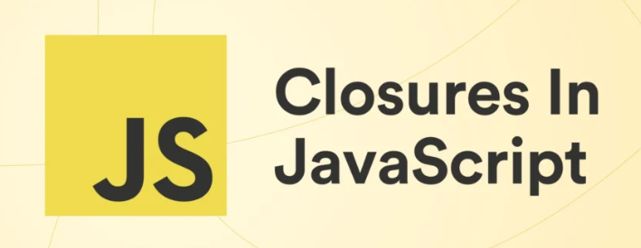

#  DevBlog


---

## Sobre o projeto

O **DevBlog** é um blog moderno feito com [Vue 3](https://vuejs.org/) + [Vite](https://vitejs.dev/), focado em compartilhar conhecimento sobre desenvolvimento web, programação e tecnologia. Aqui você encontra artigos sobre JavaScript, Vue.js, React, Node.js, Python e muito mais!

O objetivo é ajudar desenvolvedores de todos os níveis a aprenderem novas ferramentas, frameworks e boas práticas do mercado, sempre com exemplos práticos e linguagem acessível.

---

## Funcionalidades

- Listagem de posts por categoria
- Busca de artigos
- Sistema de likes e comentários (simulado)
- Newsletter (simulada)
- Página "Sobre" com informações do autor
- Interface responsiva e moderna

---

## Tecnologias Utilizadas

-  **Vue 3**
-  **Vite**
-  **JavaScript**
-  **Node.js**
-  **Python**

---

## Imagens do Projeto

### Home


### Exemplo de Post


### Vue.js


### Vue Router


---

## Como rodar o projeto localmente

```bash
# Instale as dependências
npm install

# Rode o servidor de desenvolvimento
npm run dev
```

Acesse [http://localhost:5173](http://localhost:5173) no seu navegador.

---

## Estrutura de Pastas

```
├── public/
│   ├── images/           # Imagens do blog
│   └── vite.svg          # Ícone do Vite
├── src/
│   ├── components/       # Componentes Vue
│   ├── data/             # Dados simulados (posts, categorias)
│   ├── views/            # Páginas principais
│   ├── App.vue           # Componente raiz
│   └── main.js           # Entrada do app
├── package.json
└── README.md
```

---

## Contribuição

Sinta-se à vontade para abrir issues, sugerir melhorias ou enviar pull requests! Este projeto é para a comunidade ❤️

---

## Licença

MIT
